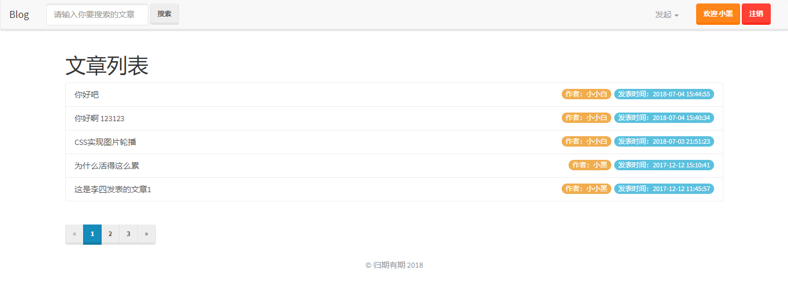
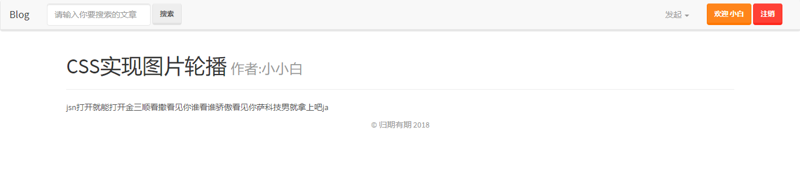
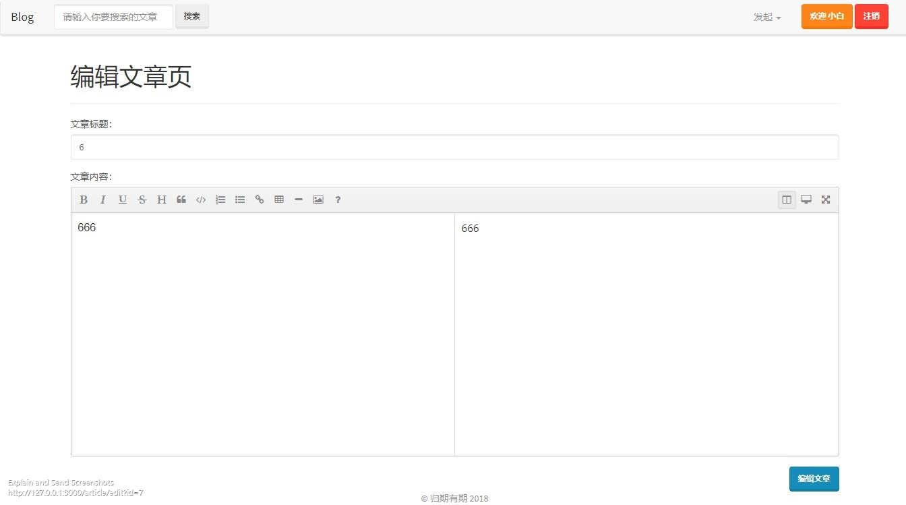
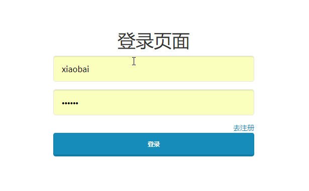

# iBlog
用 node.js 搭建属于自己的blog

## 主要技术列表
+ 服务端：Node.js 
+ 数据库：MySQL
+ 数据库操作工具：navicat for MySQL
+ WEB框架：Express
+ 模板引擎：EJS
+ JS和UI库：JQuery^3.3.1 Bootstrap^3.3.7

## 目录结构
后端采用传统的MVC结构，models是对象模型（就是数据格式），views是视图层，controllers是操作数据的层，所有的请求通过routes（路由）分发。
```
├── model (M)
├── views  (V)
├── ├── views
│   │   ├── user
│   │   ├── article
├── └── └── layouts
├── controllers (C)
│   ├── app
│   └── controller
├── routes  (路由)
│   ├── app
│   └── ro
├── node_modules
├── assets (前端一些静态文件 还没完成)
│   ├── images
│   ├── css
│   └── js
├── .gitignore
├── app.js
├── package-lock.json
├── package.json
├── readme.md
```

## 安装和运行
+ 请在Linux或者windows系统下确保安装了正确版本的Node.js 和 MySQL教程自行学习。
+ 进入目录cd iBlog
+ 安装依赖包 npm install
+ 打开MySQL，创建一个名叫node的数据库导入deco里面的blog.sql修改model.js里面的数据库连接
+ npm i 安装所需要的包
+ npm start 运行

## ScreenShot






